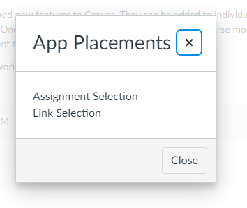

# Canvas LTI Setup

This document steps through the process of enabling the **On-Ramp To STEM**
Tool in Canvas using LTI v1.3.

In order to complete the Tool setup, the Canvas Administrator must complete these
steps and provide the following information back to the Tool owner:

1. LTI Developer Key Client ID
2. LTI Developer Key Client Secret (Show Key)
3. Deployment Id

# Admin Setup

An **LTI Key** (Developer Keys) must be created. This will generate the
required information for the Tool such as the **client_id** and
**client_secret**.

## Add LTI Developer Key


## Configure with JSON URL

The **LTI Key** can be configured using the Tool provided **JSON URL**.


---
Provide values for the **Key Name** and **Owner Email** fields. The required
**Redirect URIs** should be populated after saving the key.


### LTI Advantange Service Permission: Can Access Account Information

The JSON configuration will set most of the permissions required. However, in
order to retrieve name and email information from the services, the
admin must check and ensure the `Can lookup Account Information`
setting under the **LTI Advantage Services** section is enabled.


## Enable Key

Change the **State** of the Key from **OFF** to **ON**. Under the **Details**
column, provide the Tool owner with the **client_id** (ex. `10000000000036`)
and the **client_secret** (`Show Key`).


# Course Setup

After creating the **LTI Key**, the course must be configured to use
that Key. This is done by adding it under the **Apps** settings for the
course.

## Add App


## Add with Client ID

Enter the **LTI Key** Client ID as show on the **Developer Keys** page
under the **Details** column.


---
After submitting the Client ID, confirm installation of the App by clicking the
**Install** button on the next page.


## Confirm Installed App

After installation confirm that **On-Ramp to STEM** appears on the
**External Apps** page.


## Confirm App Placements

Using the settings drop-down menu for the App, click on the **Placements**
option


---
Confirm that both **Assignment Selection** and **Link Selection** appear as
App Placements.



# Confirm App Deployment Id

Using the settings drop-down menu for the App, click on the **Deployment Id**
option


---
Provide this identifier to the Tool owner.


# Troubleshooting

If the `email`, `name` and `picture` claims are not present in the Launch
Request, ensure that the **Privacy Level** is on the Developer Key is set to
**PUBLIC** (under "Additional Settings"). This setting may need to be updated
using the API.

Below is an example of an API call to enable the setting for a specific course:

```bash
curl -X PUT 'https://<canvas>/api/v1/courses/<course_id>/external_tools/<external_tool_id>' \
     -H "Authorization: Bearer <token>" \
     -F 'name=OR2STEM' \
     -F 'privacy_level=public'
```

As a work-around, the following "Custom Fields" can be added to the
"Additional Settings" section of the Developer Key.

```
email=$Person.email.primary
name=$Person.name.display
picture=$User.image
```
