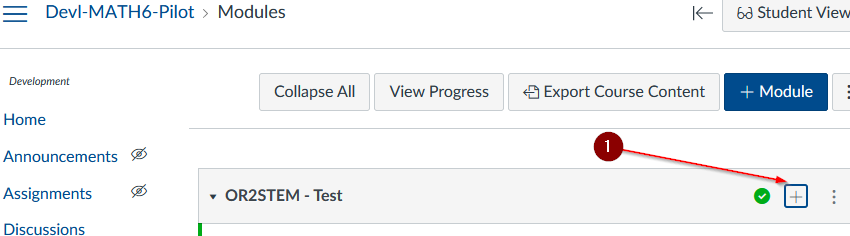
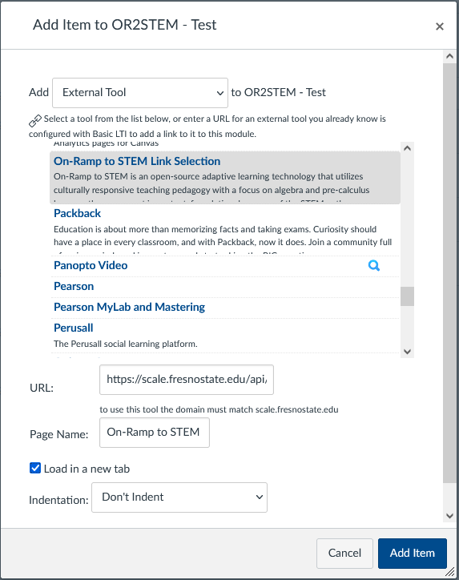
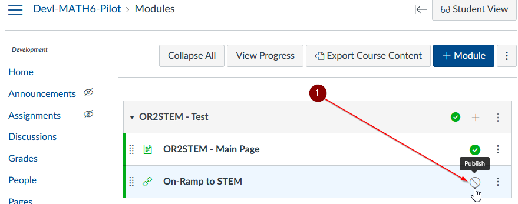
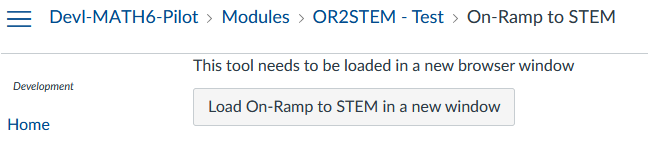

# Canvas LTI Module Link

This guide covers the steps required in order to add a Canvas Module Link for
the OR2STEM SCALE application.

# Module Add

Click the plus sign icon `[+]` to add the module link.

# Module Link Selection

Select **External Tool** as the add type. Scroll through the list of tools and
select **On-Ramp to STEM**.

The **URL** and **Page Name** will be populated automatically. Change the
**Page Name** as appropriate.

For best viewing results, be sure to enable the **Load in a new tab** checkbox.

# Module Item Publish

After adding the link for the OR2STEM tool the item must be published in order
for students to use it. Click the **Publish** [1] icon.

# Module Item Launch

When an instructor or student launches the module item they will be presented
with a button. Clicking the button should launch the tool in a new browser
tab.

